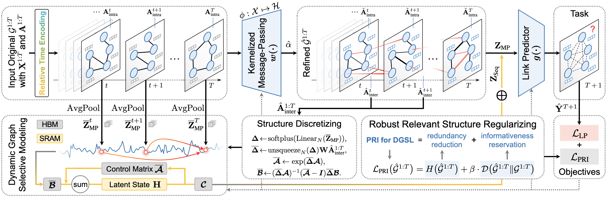

# [AAAI 2025] REDGSL: Advancing Robust Graph Representation via Efficient Dynamic Graph Structure Learning

This repository is the official implementation of "[REDGSL: Advancing Robust Graph Representation via Efficient Dynamic Graph Structure Learning]()" accepted by the Main Technical Track of the 39th Annual AAAI Conference on Artificial Intelligence (AAAI-2025).

<p align="center">

</p>

-----

### Training

To train REDGSL, run the following command in the ROOT directory :

```train
python main.py --dataset collab --load_best_config
```

Or:

```
python main.py --dataset collab --lr 0.0025 --weight_decay 1e-3 --num_layers 1 --hidden_channels 32 --num_heads 1 --rb_order 1 --rb_trans sigmoid --M 30 --K 10 --use_bn --use_residual --use_gumbel --epochs 2000 --beta1 0.1 --beta2 50.0 --gamma 0.0025 --lamda_1 0.025 --mu 1.0 --patience 500
```

### Evaluation

To evaluate REDGSL with trained models, run the following command in the ROOT directory:

```eval
python eval.py --dataset=<dataset_name>  --exp_type=<exp_mode>  --load_best_config
```

Please download pre-trained model from **link** and put the trained model in the directory `./saved_model`

Example:

```
python eval.py --dataset=yelp  --exp_type=feature  --load_best_config
python eval.py --dataset=yelp_evasive_1  --exp_type=evasive  --load_best_config
```

#### Explanations for the arguments:

- `dataset_name`: name of the datasets, including "collab", "yelp", and "act".
- `load_best_config`: if training with the preset configurations. 
- `exp_type`: adversarial attacking modes, including "clean", "structure", "feature", "evasive", and "poisoning".

#### Configurations for `dataset_name` under different attacking modes

- Non-targeted adversarial attack: `dataset_name` is chosen from "collab", "yelp", and "act".
- Targeted adversarial attack (evasive): `dataset_name` is chosen from "collab_evasive_1", "collab_evasive_2", "collab_evasive_3", "collab_evasive_4", "yelp_evasive_1", "yelp_evasive_2", "yelp_evasive_3", "yelp_evasive_4", "act_evasive_1", "act_evasive_2", "act_evasive_3", "act_evasive_4".
- Targeted adversarial attack (poisoning): `dataset_name` is chosen from "collab_poisoning_1", "collab_poisoning_2", "collab_poisoning_3", "collab_poisoning_4", "yelp_poisoning_1", "yelp_poisoning_2", "yelp_poisoning_3", "yelp_poisoning_4", "act_poisoning_1", "act_poisoning_2", "act_poisoning_3", "act_poisoning_4".
